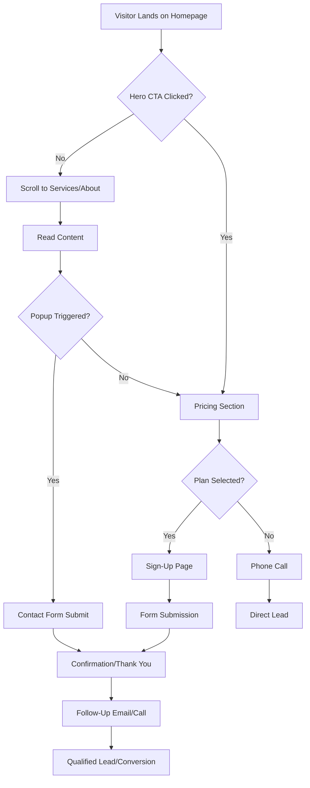

# Critique of Lead Generation Potential for Iron Wing Dispatching Website

## Executive Summary
The website for Iron Wing Dispatching is a well-structured, professional landing page aimed at owner-operators and small motor carriers in the trucking industry. It effectively communicates services, pricing, and credibility through founder experience. Lead generation is supported by clear calls-to-action (CTAs), a sign-up form, and contact mechanisms, but it lacks depth in conversion optimization, backend integration, and nurturing tools. Overall potential: **Moderate (6/10)**. With targeted improvements, it could reach high conversion rates (8-9/10) by focusing on trust-building, friction reduction, and multi-channel capture.

Key metrics to track post-implementation:
- Form submission rate
- CTA click-through rate
- Bounce rate on pricing/sign-up pages
- Email open rates (if integrated)

## Current Lead Generation Elements Analysis
### CTAs and Navigation
- Prominent "Apply Now" buttons in pricing section link directly to sign-up.html.
- "See Dispatching Rates" and "Choose a Plan Below" CTAs guide users to pricing.
- "Contact" button in nav opens a popup form for quick inquiries.
- Phone number (409-235-1185) is visible in header and footer for direct calls.

### Forms
- **Sign-up Form** (`src/sign-up-form/sign-up.html`): Collects name, email, phone, fleet size, trailer type, and selected plan. Client-side validation (required fields, minlength). Submits via JS fetch to `https://api.iron-wing-dispatching.com/contact-forms` (backend not confirmed in files).
- **Contact Popup** (`src/index.html`): Simple email/phone/message form with JS submission to the same API endpoint. Shows confirmation alert on success.
- No multi-step forms or progressive profiling to reduce abandonment.

### Content and Funnel
- Hero section builds interest with tagline and CTA to pricing.
- Services and sales pitch sections educate on value, funneling to pricing.
- Pricing page differentiates plans (Basic 4%, Standard 6%, Premium 8%) with tooltips for features.
- Blog (`src/blog/blog.html`): Provides industry insights (e.g., founder story) but articles are stubs with non-functional "Read More" links. Potential for SEO-driven traffic.
- About section emphasizes founder credibility (ex-trucker), building trust.

### Tracking and Analytics
- Google Tag Manager (GTM) integrated for events like form submissions (`form_submission_contact`).
- Web Vitals monitoring in `src/index.js` (CLS, LCP, INP) stored in localStorage—good for performance but not directly tied to leads.
- No visible pixel tracking (e.g., Facebook/LinkedIn) or heatmapping setup.

## Strengths
1. **Industry-Tailored Messaging**: Content resonates with truckers (e.g., "By Truckers, For Truckers," founder story). Builds empathy and trust, encouraging sign-ups.
2. **Clear Value Proposition**: Pricing transparency (percentage-based fees) with feature breakdowns reduces hesitation. CTAs are action-oriented and placed strategically (e.g., after services/pitch).
3. **Mobile-Responsive Design**: Assumed from viewport meta and hamburger menu; supports on-the-road users.
4. **Multiple Touchpoints**: Phone, email, form, and social links (Facebook, LinkedIn) provide low-friction options.
5. **Basic Tracking Foundation**: GTM enables event tracking; expandable for conversions.

These elements position the site as credible, potentially converting 5-10% of visitors to leads if traffic is targeted (e.g., via trucking forums/SEO).

## Weaknesses and Gaps
1. **Form Friction and Integration**:
   - Sign-up form lacks backend confirmation (JS fetch may fail if API absent—TODO in index.js notes this).
   - No auto-fill for returning users or plan pre-selection from pricing clicks.
   - Popup form is basic; no file uploads (e.g., for carrier packets) or chat integration.
   - Error handling is client-side only; no server-side validation or spam protection (e.g., reCAPTCHA).

2. **Limited Lead Nurturing**:
   - No email capture on homepage (only via popup or sign-up).
   - Blog lacks CTAs (e.g., "Sign up for more tips") or email subscription.
   - No lead magnets (e.g., free "Load Optimization Guide" PDF) to exchange for emails.
   - Absent exit-intent popups or retargeting setup.

3. **Trust and Social Proof Gaps**:
   - No testimonials, case studies, or client logos despite emphasizing "personalized experience."
   - Founder story is strong but isolated to blog/about; not leveraged in popups.
   - Privacy policy exists but is generic; no GDPR/CCPA mentions for broader appeal.

4. **SEO and Traffic Potential**:
   - Blog content is underdeveloped (placeholders); misses keyword opportunities (e.g., "trucking dispatch services Texas").
   - No schema markup for services/pricing or internal linking to boost dwell time.
   - Images have alt text but no optimized meta descriptions beyond title.

5. **Conversion Optimization**:
   - Single funnel path (pricing → sign-up); no A/B variants for CTAs.
   - No urgency (e.g., "Limited spots for new clients") or scarcity.
   - Tracking incomplete: No goal setup in GTM for full funnel (e.g., phone clicks).

These gaps likely result in high drop-off (e.g., 70-80% abandonment at forms) and low repeat visits.

## Prioritized Improvements
Prioritization based on impact/effort: High-impact/low-effort first.

1. **High Priority (Quick Wins, 1-2 weeks)**:
   - Integrate forms with a backend/CRM (e.g., Google Forms, Mailchimp, or simple Node.js API). Confirm API endpoint; add reCAPTCHA.
   - Add testimonials section to homepage (3-5 quotes from mock clients or founder references).
   - Embed email signup in footer/blog for newsletter (e.g., "Get Trucking Tips").
   - Fix blog: Complete 2-3 articles with functional CTAs linking to sign-up.

2. **Medium Priority (Optimization, 2-4 weeks)**:
   - Implement multi-step sign-up form to reduce overload (Step 1: Contact info; Step 2: Business details).
   - Add lead magnet: Create downloadable "Top 10 Load Sourcing Tips" gated by email.
   - Enhance GTM: Track CTA clicks, form abandons, and phone taps; integrate with Google Analytics goals.
   - A/B test CTAs (e.g., "Apply Now" vs. "Get Started Free Trial").

3. **Low Priority (Advanced, 4+ weeks)**:
   - Add chatbot (e.g., Tidio) for instant Q&A and lead capture.
   - SEO audit: Optimize meta tags, add schema for LocalBusiness, target keywords like "dispatch services for owner operators."
   - Social proof expansion: Video testimonials, integration with review sites (e.g., Google My Business).
   - Retargeting: Add Facebook Pixel for ad follow-up to site abandoners.

### User Journey Funnel (Mermaid Diagram)

This diagram shows the current linear funnel; improvements can add branches for nurturing (e.g., email sequences).

## Next Steps
- Review this critique and approve changes.
- Switch to Code mode for implementation (e.g., form fixes, new sections).
- Estimated ROI: 20-50% increase in leads with high-priority items.

For questions or adjustments, provide feedback.