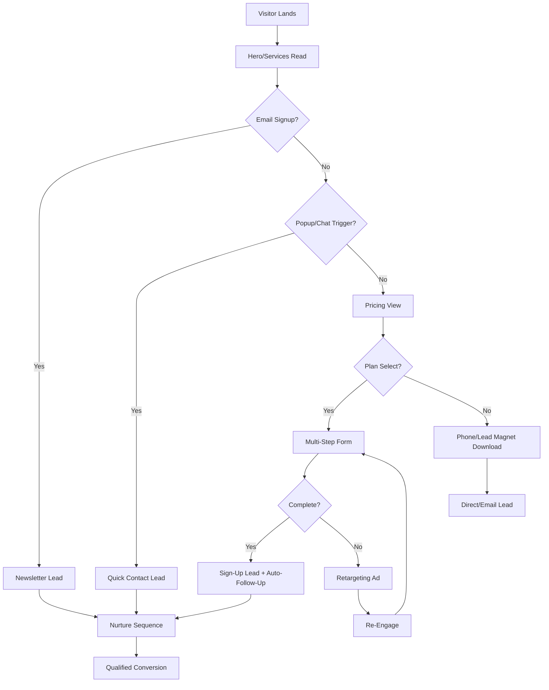

# Implementation Plan for Enhancing Lead Generation on Iron Wing Dispatching Website

## Overview
This plan outlines actionable steps to implement the prioritized improvements from the [critique.md](critique.md). It focuses on boosting lead conversion by addressing form integration, trust signals, content nurturing, and analytics. The plan is divided by priority levels (High, Medium, Low) based on impact vs. effort. Total estimated timeline: 4-6 weeks for full rollout, assuming part-time development.

**Assumptions**:
- Development in existing stack (HTML/CSS/JS, Webpack for bundling).
- No major backend changes; use third-party services (e.g., Netlify Forms, Formspree) for quick form handling if API isn't ready.
- Testing on mobile/desktop; use tools like Lighthouse for performance.
- Budget: Low (free/open-source tools); potential costs for premium services (e.g., $10-50/month for email tool).

**Success Metrics**:
- Increase form submissions by 30%.
- Reduce bounce rate on sign-up page to <40%.
- Track via Google Analytics (integrated via GTM).

**Resources Needed**:
- Developer time: 20-40 hours.
- Tools: VS Code, Git for version control, free tiers of Zoho/Cloudfare.
- Testing: Browser DevTools, Google Analytics.

## High Priority (Quick Wins: 1-2 Weeks, High Impact/Low Effort)
Focus on immediate conversion boosters. These can be implemented without major refactoring.

1. **Integrate Forms with Backend/CRM**:
   - **Goal**: Ensure form submissions are captured reliably; add spam protection.
   - **Steps**:
     - Verify/create backend endpoint (`https://api.iron-wing-dispatching.com/contact-forms`). If absent, use Formspree or Netlify Forms as interim (free for <100 subs/month).
     - Update `src/index.js` and `src/sign-up-form/sign-up.js`: Add reCAPTCHA v3 (Google free tier). Include server-side validation (e.g., email format, required fields).
     - Handle errors: Show user-friendly messages (e.g., "Submission failed—try calling (409) 235-1185").
     - Integrate with email/CRM: Forward submissions to `info@iron-wing-dispatching.com` and Zoho list for follow-up.
   - **Effort**: 4-6 hours.
   - **Files to Edit**: `src/index.js`, `src/sign-up-form/sign-up.js`, `src/sign-up-form/sign-up.html` (add reCAPTCHA script).
   - **Testing**: Submit test forms; check email/CRM receipt.

2. **Add Testimonials Section to Homepage**:
   - **Goal**: Build social proof to increase trust and conversions.
   - **Steps**:
     - Create 3-5 mock testimonials (e.g., "Iron Wing found me loads that paid 20% more—John D., Owner-Op").
     - Add new section after "Sales Pitch 2" in `src/index.html`: Use card layout similar to services (with quotes, stars, optional photos).
     - Style in `src/styles.css`: Match site theme (e.g., blue accents, responsive grid).
     - Include CTA: "Join satisfied truckers—Apply Now" linking to sign-up.
   - **Effort**: 3-5 hours.
   - **Files to Edit**: `src/index.html` (insert section), `src/styles.css` (new classes).
   - **Testing**: Ensure mobile stacking; A/B test visibility.

3. **Embed Email Signup in Footer/Blog**:
   - **Goal**: Capture emails for nurturing without full sign-up commitment.
   - **Steps**:
     - Add simple email input in footer (`src/index.html`, etc.): "Get Trucking Tips & Updates" with Zoho embed (free tier).
     - In blog (`src/blog/blog.html`): Add signup after each article (e.g., "Subscribe for more insights").
     - JS validation: Basic email check; submit to Zoho API.
     - Privacy note: Link to policy.
   - **Effort**: 2-4 hours.
   - **Files to Edit**: All HTML footers, `src/blog/blog.html`, `src/index.js` (for shared JS).
   - **Testing**: Confirm opt-in emails; unsubscribe flow.

4. **Fix Blog: Complete 2-3 Articles with CTAs**:
   - **Goal**: Turn blog into lead magnet for SEO traffic.
   - **Steps**:
     - Flesh out placeholders: Write 800-1000 word articles on "5 Tips for Maximizing Earnings" and "Compliance Checklist for Owner-Ops" (use founder insights).
     - Add functional "Read More" as anchors or modals.
     - Insert CTAs: "Ready to optimize? Sign up here" linking to pricing.
     - Optimize: Add meta descriptions, keywords (e.g., "trucking dispatch tips").
   - **Effort**: 6-8 hours (content + code).
   - **Files to Edit**: `src/blog/blog.html`, `src/blog/blog.js` (for modals), new article files if needed.
   - **Testing**: SEO check with Google Search Console.

## Medium Priority (Optimization: 2-4 Weeks, Medium Impact/Medium Effort)
Build on quick wins for deeper engagement.

1. **Implement Multi-Step Sign-Up Form**:
   - **Goal**: Reduce form abandonment by breaking into steps.
   - **Steps**:
     - Refactor `src/sign-up-form/sign-up.html`: Step 1 (Name/Email/Phone), Step 2 (Fleet/Trailer/Plan), Step 3 (Confirmation).
     - Use JS (`src/sign-up-form/sign-up.js`): Progress bar, store temp data in sessionStorage, submit on final step.
     - Pre-populate plan from pricing link (use URL params, e.g., `?plan=Basic`).
   - **Effort**: 8-10 hours.
   - **Files to Edit**: Sign-up HTML/JS/CSS.
   - **Testing**: User flow simulation; abandonment tracking in GTM.

2. **Add Lead Magnet: Downloadable Guide**:
   - **Goal**: Gate content for email capture.
   - **Steps**:
     - Create PDF: "Top 10 Load Sourcing Tips" (use Canva/Google Docs, 5-10 pages).
     - Add gated form to homepage (after services): Email for download link.
     - Host PDF on site; email delivery via backend or Zapier (free tier).
     - Promote in blog/footer.
   - **Effort**: 5-7 hours (content + integration).
   - **Files to Add/Edit**: New HTML section, JS for form, assets for PDF.
   - **Testing**: Download confirmation; track in GTM as "lead_magnet_download".

3. **Enhance GTM: Full Funnel Tracking**:
   - **Goal**: Measure lead performance accurately.
   - **Steps**:
     - Add events: CTA clicks (`gtm.click`), form starts/abandons, phone taps.
     - Set up GA goals: Form submit = conversion.
     - Integrate pixels: Facebook/LinkedIn for retargeting (add scripts to head).
   - **Effort**: 4-6 hours.
   - **Files to Edit**: All HTML heads, `src/index.js` (event pushes).
   - **Testing**: GA real-time reports; simulate user journey.

4. **A/B Test CTAs**:
   - **Goal**: Optimize button text/color for higher clicks.
   - **Steps**:
     - Use Google Optimize (free) or simple JS variants.
     - Test: "Apply Now" vs. "Start Earning More" on pricing buttons.
     - Track clicks/submissions; run for 1-2 weeks.
   - **Effort**: 3-5 hours setup + monitoring.
   - **Files to Edit**: Pricing section in `src/index.html`, JS for variants.
   - **Testing**: Split traffic; analyze results.

## Low Priority (Advanced: 4+ Weeks, High Impact/High Effort)
Long-term enhancements for scalability.

1. **Add Chatbot**:
   - **Goal**: Instant engagement for queries.
   - **Steps**:
     - Integrate Tidio or Intercom (free tier for basics).
     - Script: Answer FAQs (e.g., "What's the Basic Plan?"), capture leads.
     - Place on all pages.
   - **Effort**: 4-6 hours.
   - **Files to Edit**: HTML heads for script.
   - **Testing**: Bot responses; lead handoff.

2. **SEO Audit and Optimization**:
   - **Goal**: Drive organic traffic.
   - **Steps**:
     - Add schema (JSON-LD) for services/pricing via `src/index.html`.
     - Optimize metas: Keywords in titles/descriptions.
     - Internal links: Blog to services.
     - Submit sitemap to Google.
   - **Effort**: 6-8 hours.
   - **Files to Edit**: All HTML heads, `src/sitemap.xml`.
   - **Testing**: Search Console validation.

3. **Social Proof Expansion**:
   - **Goal**: More credibility.
   - **Steps**:
     - Add video testimonials (record 1-2 short clips).
     - Integrate Google My Business reviews.
     - Dynamic section: Pull from API if available.
   - **Effort**: 5-7 hours.
   - **Files to Edit**: Testimonials section.
   - **Testing**: Embed playback.

4. **Retargeting Setup**:
   - **Goal**: Re-engage abandoners.
   - **Steps**:
     - Add Facebook Pixel events (view content, initiate checkout).
     - Create ad audiences for site visitors.
     - Basic campaign: "Forgot to sign up? Get 1st month discount."
   - **Effort**: 3-5 hours.
   - **Files to Edit**: GTM/JS for events.
   - **Testing**: Pixel helper verification.

## Rollout Strategy
- **Week 1**: High priority (forms, testimonials, email signup, blog fixes).
- **Weeks 2-3**: Medium priority (multi-step form, lead magnet, GTM, A/B).
- **Weeks 4-6**: Low priority (chatbot, SEO, social proof, retargeting).
- **Post-Launch**: Monitor GA for 2 weeks; iterate based on data.
- **Risks**: Form integration delays if API issues; mitigate with third-party fallback.
- **Dependencies**: Access to email/CRM; content approval for testimonials/PDF.

## User Journey Funnel Updates (Mermaid Diagram)

This updated funnel incorporates nurturing loops.

## Next Steps
- Review and approve this plan.
- Prioritize phases if needed.
- Switch to Code mode for development.

Feedback welcome for adjustments.